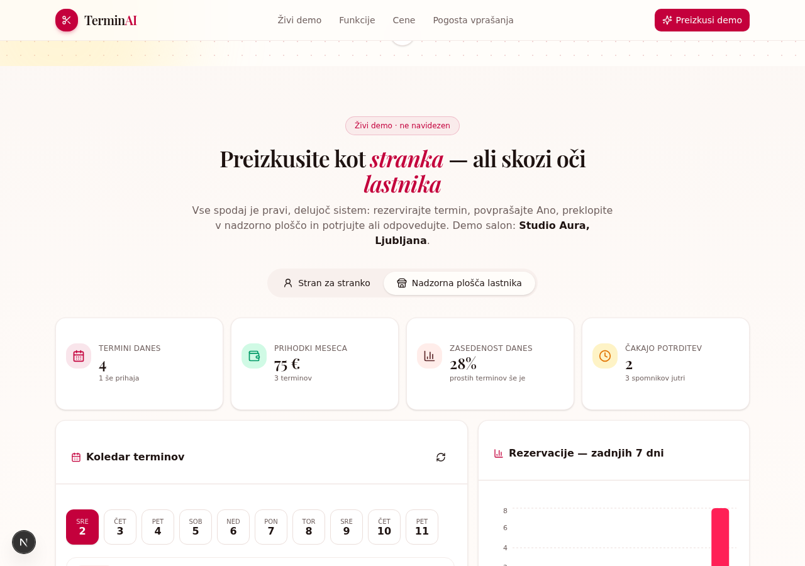
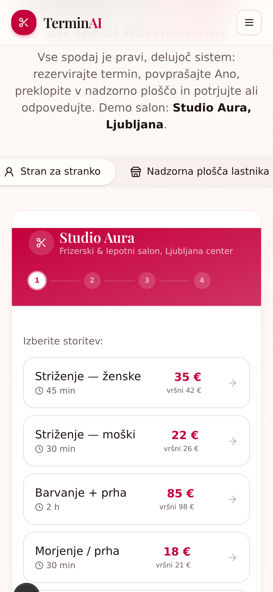
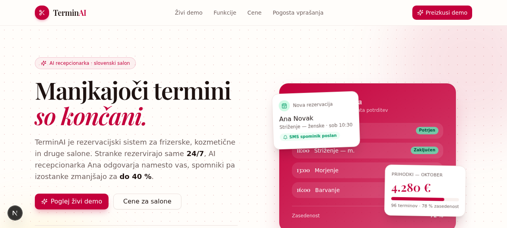
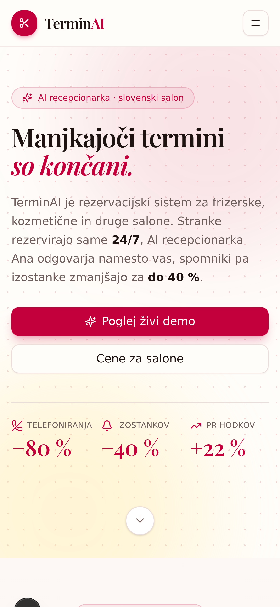

# TerminAI — pametni sistem za naročanje za frizerske in kozmetične salone

**TerminAI** je popolnoma delujoč sistem za naročanje terminov, zasnovan za frizerje, kozmetične in druge lokalne storitvene podjetnike. Deluje **100 % brez interneta** — vsi podatki ostanejo na računalniku lastnika (SQLite datoteka), zato je idealen za prodajo po principu **"enkrat namesti, deluje za vedno"**.

> Predstavljen z demo podatki frizerskega salona **Studio Aura, Ljubljana**.

---

## Ključne funkcije

### 🗓️ Naročanje terminov
- Interaktivni koledar s 30-minutnimi termini in samodejnim zaznavanjem **prekrivanja**
- Delovni čas po dnevih (nedelja–sobota), samodejni predlogi prostih terminov
- **Vrhovni doplaček**: sobote in delavniki po 15. uri se zaračunajo po višji ceni
- Statusi terminov: `pending → confirmed → completed / cancelled / no_show`

### ❌ Odpoved z enim klikom (enkratna povezava)
- Vsak termin ima svojo **odpovedno povezavo** (`/?cancel=token`) — brez PIN-a, token je overitev
- Povezava je vključena v **WhatsApp spominik** („Če ne morete priti, termin odpovejte tukaj …“) in potrditev rezervacije
- Stranka klikne, vidi termin in ga odpove — **termin se takoj sprosti** za druge
- Lastnik lahko povezavo **kopira v odložišče** (gumb v koledarju) in jo pošlje po WhatsAppu

### 📱 Oddaljeno naročanje (brez plačljivih API-jeev)
- **WhatsApp gumb** — stranka s klikom odpre pogovor (`wa.me`), sporočilo se samodejno izpolni z izbrano storitvijo
- **QR koda** — natisnjena koda za ogledalo v salonu: stranka poskenira in se naroči sama
- **Ročni vnos** — lastnik ob telefonskem klicu vpiše naročilo v 30 sekundah (isti API, isto preverjanje prekrivanja)

### 💬 Pametna obravnava SMS/WhatsApp sporočil
- Strankino sporočilo (npr. *"naročam se na striženje plus barvanje"*) program **razčleni**:
  - prepozna storitve iz cenika in sešteje ceno (*striženje 25 € + barvanje 55 € = 80 €*)
  - ob zasedenem terminu ponudi **najbližje proste alternative**
  - ob povpraševanju pošlje **celoten cenik**
  - shrani **izvirno sporočilo** in pripravi osnutek odgovora za lastnika
- Predal "Sporočila" (inbox) z nameni (intent): `booking | price | cenik | availability`

### 🛠️ Lastnik vse ureja sam
- **Cenik** (storitve, trajanje, redna/vrhovna cena) — poljen CRUD
- **Podatki salona**: ime, naslov, telefon, delovni čas
- **Baza strank** z zgodovino obiskov
- **Statistika**: prihodki, zasedenost, najbolj donosne storitve
- **Izvoz iCal (.ics)** — koledar terminov uvozite v Google/Apple Koledar ali telefon

### 📊 Mesečno poročilo + CSV za knjigovodstvo
- Zavihek **„Poročila“**: izbrani mesec — realizirani/pričakovani prihodki, povprečni obisk, odpovedi/izostanki
- **Graf prihodkov po dnevih** in top 5 storitev/strank meseca
- **CSV izvoz** z obračunanimi obiski (samo zaključeni): UTF-8 BOM, podpičja, decimalna vejica — Excel ga odpre brez pretvorb
- Navigacija po mesecih (samo meseci z podatki)

### ✨ Demo način (za prodajne obiske)
- Ena klik **„Obnovi demo podatke“** (vpis DEMO + PIN): Studio Aura z bogato zgodovino (~40 dni, ponavljanja, izostanki)
- Po predstavitvi sledi „Nastavi pravi salon“ — prehod na prave podatke

### ⚠️ Sledenje izostankov (no-show)
- En klik **„Ni prišla“** na pretekel termin (mesto klica odpovedi)
- Izostanki se **samodejno štejejo pri stranki** — rdeča oznaka „2× ni prišla“ v bazi strank
- Izostanki se ne štejejo v obiske, prihodke ali zasedenost

### 🔁 Ponavljajoči obiski — "kdo je na vrsti"
- Termin dobi oznako ponavljanja (npr. **barvanje vsake 4 tedne**, striženje vsaka 3 tedna)
- Sistem sam izračuna, **katere stranke je treba poklicati** (rok je potekel / na vrsti / kmalu)
- En klik: **WhatsApp vabilo** s pripravljenim sporočilom ali **naročitev** termina
- Stranke, ki so že naročene, so ločeno označene

### 💾 Samodejne varnostne kopije
- Ob vsakem zagonu (največ 1× dnevno) se naredi **konsistenten snapshot** baze (`VACUUM INTO`)
- Zadnjih 14 kopij v mapi `db/backups` — brez ročnega dela
- Kartica "Varnostne kopije": seznam, ročna kopija, **prenos na USB** prek brskalnika

### 🔒 Zasebnost in offline način
- SQLite zbirka v **enki datoteki** → enostavna rezervacija (USB)
- Ni odvisnosti od oblaka, naročnin ali interneta
- Zaščita lastniškega območja s PIN-kodo

---

## Tehnični sklad

| Plast | Tehnologija |
|---|---|
| Ogrodje | **Next.js 16** (App Router) + React 19 |
| Jezik | TypeScript 5 |
| Baza | **Prisma ORM + SQLite** |
| UI | shadcn/ui (New York), Tailwind CSS 4, Lucide ikone |
| Grafi | Recharts |
| QR kode | qrcode.react |
| Med seboj povezani podatki | TanStack Query |

---

## Namestitev (razvoj)

```bash
# 1. Namesti odvisnosti
bun install

# 2. Ustvari .env z DATABASE_URL
echo 'DATABASE_URL="file:/home/z/my-project/db/custom.db"' > .env

# 3. Ustvari shemo baze
bun run db:push

# 4. Zaženi razvojni strežnik
bun run dev          # http://localhost:3000
```

> Zaženi `bun run setup` API klic ali odpri aplikacijo — demo podatki (Studio Aura) se naložijo samodejno ob prvem zagonu.

### Koristni ukazi

```bash
bun run dev        # razvojni strežnik (port 3000)
bun run lint       # preverjanje kakovosti kode (ESLint)
bun run db:push    # sinhronizacija Prisma sheme z SQLite
bun run db:generate # generiranje Prisma klienta
```

---

## Zagon kot offline "USB izdelek"

Projekt vsebuje pripravljeno **USB predlogo** (`usb-template/`) za prodajo:

```
usb-template/
├── ZAGON.bat        # zaženi aplikacijo
├── NAMESTI.bat      # prva namestitev
├── NAREDI-REZERVO.bat  # rezervacija baze na USB
├── NAVODILA.txt     # navodila za lastnika salona
└── ZA-TEBE.txt      # opombe za prodajalca/namestilca
```

Baza (`db/custom.db`) je prenosljiva datoteka — rezervacija na USB in prenos na drug računalnik delujeta brez posegov.

---

## Struktura projekta

```
prisma/schema.prisma        # Business, Service, Client, Appointment, Message, WorkingHours
src/app/api/                # REST API
├── appointments/           # CRUD termini + prekrivanja
│   ├── recurrence/         # "kdo je na vrsti" (ponavljajoči obiski)
│   ├── cancel/             # odpoved prek enkratne povezave (GET/POST, token)
│   └── ical/               # izvoz koledarja (.ics)
├── availability/           # prosti termini
├── services/               # cenik (CRUD)
├── clients/                # baza strank (+ števec izostankov)
├── messages/               # SMS/WhatsApp sporočila + razčlenjevanje
├── stats/                  # statistika
├── reports/                # mesečno poročilo + CSV izvoz (?month=YYYY-MM&format=csv)
├── hours/                  # delovni čas
├── backup/                 # varnostne kopije (seznam, ustvari, prenos)
├── setup/                  # inicializacija: mode=fresh (pravi salon) | mode=demo (obnova dema)
└── pin/                    # zaščita lastniškega območja
src/components/terminai/    # UI komponente (hero, koledar, cenik, inbox …)
src/lib/recurrence.ts       # logika ponavljajočih obiskov
src/lib/backup.ts           # samodejni backup (VACUUM INTO)
src/lib/clipboard.ts        # kopiranje v odložišče (tudi http:// LAN)
src/instrumentation.ts      # vzdrževalne naloge ob zagonu strežnika
db/custom.db                # SQLite baza (prenosljiva)
db/backups/                 # samodejne varnostne kopije (zadnjih 14)
usb-template/               # predloga za USB prodajo
```

---

## Podatkovni model

```
Business 1─n Service 1─n Appointment n─1 Client
Business 1─n WorkingHours
Message (neodvisna tabela za sprejeta sporočila strank)
```

- termini shranjeni v **UTC**, prikaz v lokalnem času
- cene v **centih** (natančnost, brez plavajoče vejice)
- vsak termin: `startAt`, `endAt`, `priceCents` (zamrznjena cena ob naročilu), `recurWeeks` (ponavljanje), `cancelToken` (odpovedna povezava), `status` vključno z `no_show` (izostanek)

---

## Slike

| Namizni pogled | Mobilni pogled |
|---|---|
|  |  |
|  |  |

---

## Poslovni model (offline izdelek)

| Paket | Vsebina | Cena |
|---|---|---|
| **Osnovni** | namestitev na računalnik lastnika, offline delovanje, rezervacija na USB | **199 € enkratno** |
| Vzdrževanje | posodobitve, tehnična podpora | 19 €/mes. |
| Ana AI (dodatek) | pametno odgovarjanje na sporočila z AI, spletne nadgradnje | 39 €/mes. |

*Povezava na splet ni potrebna — vse osnovne funkcije delujejo lokalno.*

---

## Licenca

Vse pravice pridržane — komercialni izdelek.
